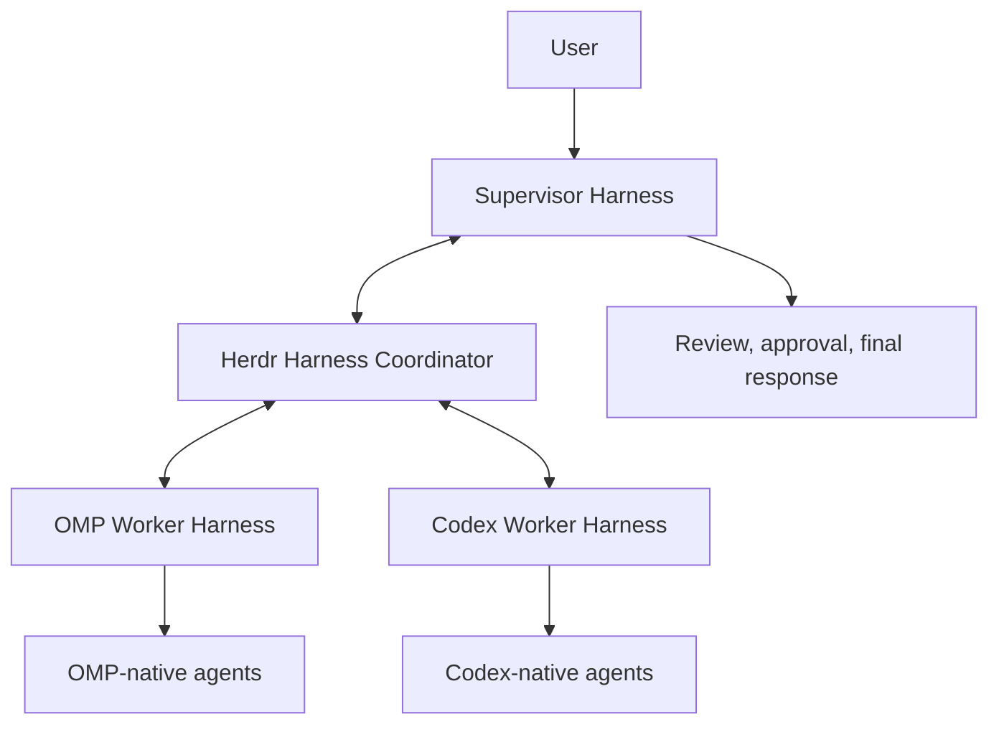
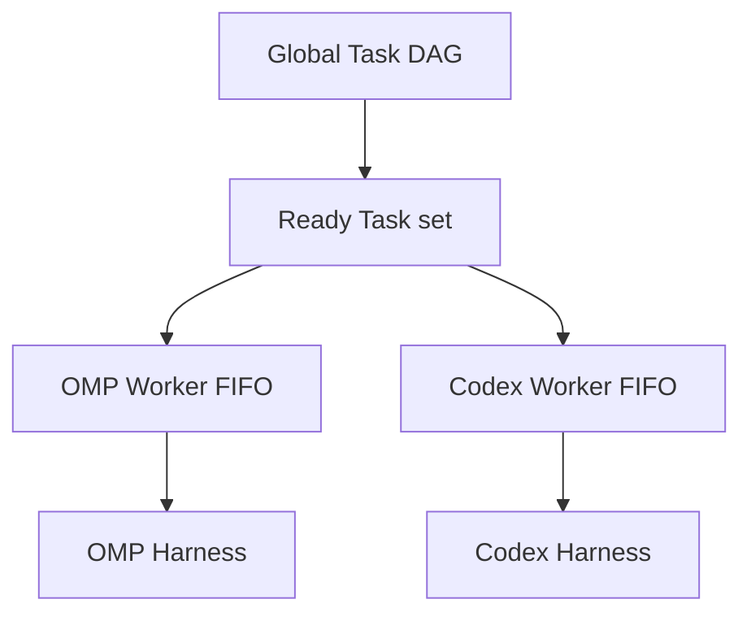
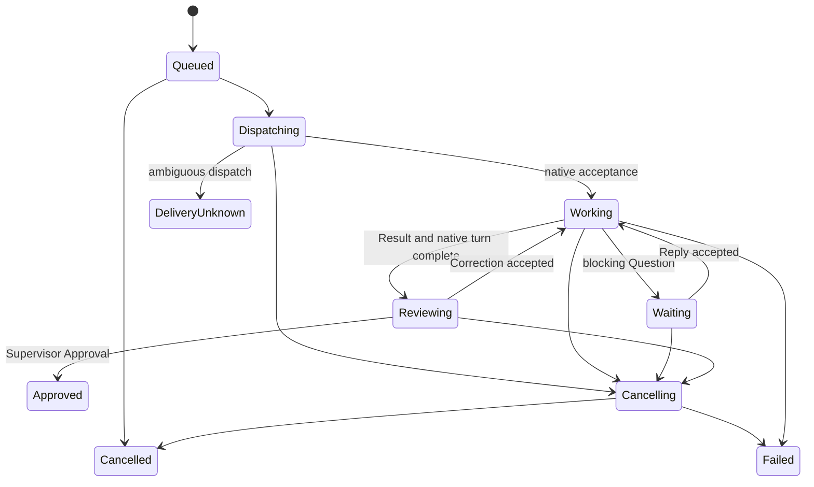

# Herdr Harness Coordinator

## Overview

Herdr Harness Coordinator is a lightweight Rust plugin that connects autonomous coding-agent harnesses running in ordinary Herdr panes. One high-capability Supervisor Harness decides direction and reviews results. Cost-efficient Worker Harnesses execute bounded Tasks and may use their own native multi-agent systems.

The Coordinator is not a workflow engine and does not replace OMP, Codex, or their child-agent behavior. It owns only:

- durable Harness identities and live Harness Sessions;
- one Supervisor-authored global Task dependency graph and per-Worker FIFO admission;
- short cross-harness messages and immutable Attachments;
- delivery attempts, receipts, questions, corrections, and approvals;
- top-level harness process and Herdr pane lifecycle;
- advisory serialization and observation of live Git worktrees; and
- SQLite state, metadata, and a Ratatui popup.

The initial Harness Kinds are OMP and Codex. Pi is first after the MVP; OpenCode follows when its session integration is justified.

## Authority

The Supervisor Harness is the single semantic authority. It owns:

- user intent and technical direction;
- architecture and product decisions;
- Task decomposition and Worker selection;
- acceptance criteria and verification expectations;
- review of Results, diffs, and evidence;
- corrections, cancellation, and Worktree Hold reconciliation; and
- final approval and the user-facing response.

Worker Harnesses own bounded execution. A Worker may search, edit, test, and use native children, but it must return unresolved decisions to the Supervisor and produce one consolidated Result.

The Coordinator owns transport and lifecycle authority. It never invents a technical decision, decomposes a Task, selects a Worker or model automatically, interprets native child trees, or treats Worker completion as Supervisor approval.



Only one active Supervisor Harness is allowed for one Coordinator state directory. Worker-to-Worker communication is rejected in the MVP.

## Core domain model

### Harness

A Harness is a durable mailbox address and launch definition. Its `id` is a user-selected immutable slug such as `supervisor`, `omp-worker`, or `codex-review`. For a Worker, `cwd` is the canonical Git worktree root and therefore the registered repository identity used by Task admission.

```rust
pub struct HarnessDefinitionV1 {
    pub schema_version: u32,
    pub id: HarnessId,
    pub kind: HarnessKind,
    pub tier: HarnessTier,
    pub cwd: PathBuf,
    pub launch_profile: Option<String>,
    pub model: Option<String>,
}

pub enum HarnessKind {
    Omp,
    Codex,
}

pub enum HarnessTier {
    Supervisor,
    Worker,
}
```

Harness IDs are unique within one Coordinator state directory and are never reused for a different Harness definition. Stopping a Harness makes it offline; it does not delete its mailbox or identity.

The Coordinator records model and launch profile explicitly but does not infer cost, capability, or routing from them.

### Workspace Activation

The Herdr plugin is installed globally, but coordination is off by default in every workspace. A workspace-context action opens the Harness Network popup for the invoking workspace. Automation uses the idempotent commands `workspace get`, `workspace set on|off`, and `workspace list`; there is no raw toggle command whose duplicate delivery could reverse the user's intent.

The plugin-root activation index keys a record by Herdr session socket plus workspace ID, records the canonical repository root, and routes live state beneath `workspaces/<sha256>`. Each record retains a compare-and-set revision, desired and runtime states, the explicit Supervisor declaration, exact Worker-to-profile mappings, and recovery diagnostics. A partial unique constraint permits only one enabled workspace for a canonical worktree. Reusing a workspace ID with a different root is rejected. Current Herdr does not expose a workspace generation token, so same-ID, same-root recreation cannot yet be distinguished from restart; cold state therefore requires explicit reactivation and never replays native work.

Turning a workspace off preserves SQLite, inboxes, Attachments, Results, logs, profile snapshots, and compatibility evidence. It refuses while any Task is nonterminal or reviewing, a Worker is busy, or a Worktree Hold exists. It never cancels, approves, clears, reverts, cleans, publishes, or discards work.

### Harness Session

A Harness Session is one live activation of a Harness.

```rust
pub struct HarnessSession {
    pub id: HarnessSessionId,
    pub harness_id: HarnessId,
    pub native_session_id: Option<String>,
    pub terminal_id: Option<String>,
    pub pane_id: Option<String>,
    pub presence: HarnessPresence,
    pub activity: HarnessActivity,
    pub event_sequence: u64,
    pub started_at: DateTime<Utc>,
    pub last_seen_at: DateTime<Utc>,
    pub ended_at: Option<DateTime<Utc>>,
}
```

`HarnessSessionId` is Coordinator-generated UUIDv7. Native session identity, Herdr `terminal_id`, and mutable `pane_id` are separate because they have different lifetimes.

```rust
pub enum HarnessPresence {
    Starting,
    Online,
    Disconnected,
    Stopped,
    Failed,
}

pub enum HarnessActivity {
    Idle,
    Working,
    Waiting,
    Cancelling,
}
```

An idle Worker Session may execute multiple Tasks sequentially in the same native conversation when the Task Session reuse rules allow it. Failure, forced cancellation, or an ambiguous native state ends the Session; reuse then requires an explicit new activation under the same Harness identity. Each Session records provider-neutral native health (`healthy`, `context_pressure`, `compacted`, `ambiguous`, `failed`) and context evidence from Adapter snapshots; reuse decisions consult this evidence only after identity and policy compatibility.

The current Herdr harness registers as the Supervisor. Worker Sessions are launched by the Coordinator in plugin-owned panes. Adopting arbitrary existing Worker panes is deferred.

### Task

A Task is a first-class bounded assignment to one Worker Harness.

```rust
pub struct TaskSubmissionV1 {
    pub schema_version: u32,
    pub request_key: Option<String>,
    pub worker_id: HarnessId,
    pub related_task_id: Option<TaskId>,
    pub depends_on: Vec<TaskDependencyV1>,
    pub task_role: TaskRole,
    pub session_reuse: SessionReusePolicy,
    pub preferred_session_id: Option<HarnessSessionId>,
    pub title: String,
    pub instructions: String,
    pub attachments: Vec<AttachmentId>,
    pub repository: TaskRepositoryAuthorityV1,
}

pub enum TaskRole {
    Implementation,
    Investigation,
    Review,
    Verification,
    Other,
}

pub enum SessionReusePolicy {
    Required,
    Prefer,
    Fresh,
    Auto,
}

pub struct TaskDependencyV1 {
    pub task_id: TaskId,
    pub condition: DependencyCondition,
    pub failure_policy: DependencyFailurePolicy,
}

pub enum DependencyCondition {
    ResultReady,
    Approved,
}

pub enum DependencyFailurePolicy {
    Cancel,
    KeepBlocked,
}

pub struct TaskRepositoryAuthorityV1 {
    pub root: PathBuf,
    pub access: RepositoryAccess,
    pub write_scopes: Vec<WriteScopeV1>,
}

pub enum RepositoryAccess {
    ReadOnly,
    Mutating,
}

pub enum WriteScopeV1 {
    ExactFile { path: PathBuf },
    Subtree { path: PathBuf },
}
```

All MVP Tasks target a Git worktree. The canonical worktree root must match the selected Worker's registered repository. A mutating Task requires at least one write scope; a read-only Task requires none. Paths are normalized repository-relative UTF-8 paths and may not be absolute, traverse parents, enter `.git`, or escape through symlinks.

`related_task_id` records informational review or verification context for presentation and audit. It never controls scheduling. `depends_on` records immutable scheduling edges to existing Tasks in the same Coordinator state directory and repository authority. The Supervisor remains responsible for Task decomposition, Worker choice, and graph design; the Coordinator only validates and admits the declared graph.

Dependency submission rejects missing or duplicate upstream Tasks, self-edges, cross-state-directory or cross-repository edges, unsupported conditions, and cycles before committing the Task. Dependency edges cannot be changed after dispatch. The Coordinator does not create branches: fan-out is several declared Tasks becoming Ready together, and fan-in is one Task waiting for all of its declared edges.

### Task scheduling

The global dependency graph is an admission layer above the existing per-Worker FIFO behavior:



Scheduling state is independent of execution state. `Blocked` means at least one dependency condition is unsatisfied. `Ready` means every dependency condition is satisfied, but Worker capacity, FIFO position, repository admission, or a Worktree Hold may still prevent dispatch. A Task with no dependencies is immediately Ready. A Blocked Task never acquires an Advisory Worktree Lease.

Ready Tasks targeting different idle Workers may dispatch concurrently. For one Worker, creation order remains FIFO: a later Ready Task does not bypass an earlier Ready Task whose repository admission is waiting. The Worker Session still runs one active top-level Task, and repository eligibility remains a separate, later admission check. Dependency edges never create Worker-to-Worker communication.

`ResultReady` is satisfied only when a valid structured Result exists, the native top-level turn has settled, the Task has entered `Reviewing`, and no Worktree Hold prevents using that checkpoint. `Approved` is satisfied only after explicit Supervisor Approval. Each satisfied edge records the exact upstream Result revision. Dispatch freezes that revision and delivers a Coordinator-owned immutable Result snapshot Attachment; large Results are not inlined into Task text.

If a Correction is accepted before a dependent dispatches, provisional `ResultReady` satisfaction is revoked and the dependent is blocked until a new reviewable revision is available. A Correction never silently changes an already-dispatched dependent and never causes automatic downstream replay. The Supervisor may create, cancel, or replace stale downstream work explicitly.

Each edge has a simple failure policy. `Cancel`, the default, cancels an undispatched dependent when its upstream Task fails or is cancelled. `KeepBlocked` leaves it for explicit Supervisor reconciliation. Delivery uncertainty, Worktree Holds, and an unapproved `Approved` dependency keep dependents Blocked; the Coordinator does not infer success.

### Task Session reuse

An idle Worker Session may execute several Tasks sequentially in one native conversation, but reuse is a declared, auditable decision rather than an accident of timing. Session selection runs after dependency readiness and per-Worker FIFO admission and before dispatch; the DAG orders work, and reuse never reorders it.

`Required` binds the Task to its `preferred_session_id` or fails. `Prefer` reuses a compatible healthy Session when one exists. `Fresh` requires a Session that has never run another Task. `Auto` resolves conservatively from `task_role`: `review` and `verification` start fresh, `implementation` related to or dependent on earlier work prefers reuse, and everything else starts fresh.

A candidate Session must match the Worker definition, Harness Kind, launch-profile snapshot, canonical repository, tool policy, and effective model; be online and idle; and carry no active Task, unresolved Question, ambiguous delivery, unresolved cancellation, or unresolved Worktree Hold. Native health is consulted last: `failed`, `ambiguous`, and `context_pressure` reject; `compacted` satisfies only an explicit reuse request, never `auto`. Sessions record native health and context evidence (tokens, window, percent, compaction count) from Adapter snapshots for exactly this gate.

Every decision persists as a durable Task Session Binding with the requested and effective policy, a reuse flag, a stable reason code, and the Adapter snapshot at decision time. One current binding per Task; it survives restart and is revalidated at dispatch. A rejected candidate blocks dispatch rather than silently binding an incompatible Session.

### Task lifecycle



A Result means ready for review, not complete. Approval is the normal terminal state and is the only normal event that releases a mutating Task's Advisory Worktree Lease.

A blocking Question moves the Task to `Waiting`; the lease remains held. A Reply resumes the same Task. A Correction also remains inside the same Task and produces a new Result revision.

Queued cancellation cannot have changed the repository and needs no Worktree Hold. Failure, cancellation, or delivery uncertainty after native dispatch of a mutating Task creates a Worktree Hold until the Supervisor reconciles the live repository.

### Result

Worker completion uses a small, versioned Result contract instead of a universal artifact hierarchy.

```rust
pub struct ResultManifestV1 {
    pub schema_version: u32,
    pub task_id: TaskId,
    pub summary: String,
    pub changed_files: Vec<PathBuf>,
    pub verification: Vec<VerificationResultV1>,
    pub deviations: Vec<String>,
    pub risks: Vec<String>,
    pub attachments: Vec<AttachmentId>,
}

pub struct VerificationResultV1 {
    pub command: String,
    pub exit_code: i32,
    pub passed: bool,
    pub evidence: AttachmentId,
}
```

The Worker submits exactly one accepted Result per native turn through the Coordinator tool surface. The Task enters `Reviewing` only after the Result validates and the top-level native turn settles. Natural-language output is retained as transcript evidence but is not parsed as the Result.

Native children are never assigned Coordinator identities. Any tool call by a native descendant is attributed to its containing Worker Harness; the cooperative MVP relies on the top-level harness to consolidate its final Result.

## Communication

### Message model

```rust
pub struct BusMessage {
    pub id: MessageId,
    pub task_id: Option<TaskId>,
    pub from: HarnessId,
    pub to: HarnessId,
    pub kind: MessageKind,
    pub text: String,
    pub attachments: Vec<AttachmentId>,
    pub reply_to: Option<MessageId>,
    pub delivery: DeliveryIntent,
    pub created_at: DateTime<Utc>,
}

pub enum MessageKind {
    Task,
    Result,
    Question,
    Reply,
    Correction,
    Notification,
}

pub enum DeliveryIntent {
    FollowUp,
    Steer,
}
```

The broker derives `from` from the authenticated Harness Session. Caller input never controls authoritative sender identity.

Allowed routes are closed:

| Sender | Recipient | Allowed purpose |
| --- | --- | --- |
| Supervisor | Worker | Task, Reply, Correction, Notification |
| Worker | Supervisor | Question, Result, Notification |

Task creation and Result completion use dedicated operations because they carry structured contracts. `harness_send` cannot forge them.

`FollowUp` is the default. The Coordinator retains FollowUp messages until the target can safely begin the next native turn. `Steer` is allowed for a Supervisor message to the Worker currently executing the referenced Task and, for native Supervisor injection only, an explicitly urgent blocking Question with a bounded `steer_reason` explaining why the answer invalidates active Supervisor work. It maps directly to the adapter's verified steering operation. There is no `Auto` intent.

### Durable delivery

Messages are persisted before native dispatch. Each attempt is append-only and records whether provider bytes may have been accepted, the native correlation identifier, timestamps, and error evidence.

```rust
pub enum DeliveryState {
    Pending,
    Dispatching,
    Accepted,
    RetryableFailed,
    PermanentFailed,
    Unknown,
    Cancelled,
}
```

Native acceptance is not Task processing or completion. OMP prompt acknowledgement and Codex turn creation are only acceptance evidence.

The Coordinator retries automatically only while it can prove no provider bytes were accepted, including while a Harness is offline. If dispatch might have succeeded but acknowledgement is lost, the attempt becomes `Unknown`; Tasks, Corrections, Replies, and cancellation are never blindly replayed. The Supervisor must inspect and explicitly retry, cancel, or reconcile.

FollowUp ordering is FIFO per Worker. The dependency graph first determines whether a Task is Ready; per-Worker FIFO then determines dispatch order, Worker capacity determines whether the head may start, and repository admission determines whether a mutating Task may acquire authority. One active Task is permitted per Worker Session. A Task acquires repository authority only when it is Ready, reaches the head of the queue, and the Worker and worktree are eligible.

### Attachments

Raw paths are admission input, not durable references. The Coordinator atomically copies an accepted file into `$HERDR_PLUGIN_STATE_DIR/attachments`, records its digest, size, original name, and media type, and stores only the Attachment identity in messages and Results.

Task files, diffs, verification logs, transcripts, and reports remain ordinary files. The Coordinator does not impose a universal semantic artifact schema and does not garbage-collect Attachments in the MVP.

### Supervisor delivery

Worker Sessions are adapter-owned, so delivery to them is push-based. The Supervisor has two supported shapes.

> Worker Results always become durable Supervisor Inbox state. When a healthy Coordinator-managed Supervisor Session is bound, important events are additionally injected as safe native follow-up turns. Durable state remains authoritative.

A managed Supervisor runs in a Coordinator-launched pane whose Supervisor Host owns one Supervisor Adapter. The Host binds the visible native conversation, records its native session and thread identity, and injects durable Supervisor Events as follow-up or steer turns:

```rust
pub struct SupervisorEvent {
    pub id: SupervisorEventId,
    pub kind: SupervisorEventKind,
    pub task_id: Option<TaskId>,
    pub result_revision: Option<u32>,
    pub summary: String,
    pub attachments: Vec<AttachmentId>,
    pub created_at: DateTime<Utc>,
}

pub enum SupervisorEventKind {
    ResultReady,
    BlockingQuestion,
    TaskFailed,
    DeliveryUnknown,
    WorktreeHoldCreated,
    TaskGraphCompleted,
    Notification,
}
```

The durable-Inbox rule is exact: every Supervisor-attention fact persists as a Supervisor Event in the same transaction as its source fact, before any native injection. Events deduplicate on a unique source key, deliver oldest-first with at most one in flight, and record immutable attempts. Follow-up events are claimed only while the native Supervisor is idle, so a busy turn is never interrupted; progress-only adapter events never wake the model. `accepted` is provider acceptance, not model processing. The Host proves `presented` by reading the exact bound native conversation and observing the durable Event ID; native turn-start and turn-completion observations are appended separately and do not substitute for that proof. If the marker cannot be proved after acceptance, delivery becomes `unknown` rather than being inferred successful. `processed` still requires explicit Supervisor acknowledgement and also marks the source inbox Message read. Ambiguous injection becomes `unknown` and settles only through an append-only reconciliation record with an audit note; reconciliation never rewrites the immutable event payload or acceptance evidence. Pending events survive every restart and are claimed after the next bind; nothing is replayed blindly.

A self-registered unmanaged Supervisor keeps the pull model. A Worker Result becomes durable Supervisor inbox state plus Herdr metadata and popup notification; the Coordinator cannot inject a new turn into an already-running Supervisor process it does not own.

The Supervisor reads its inbox through MCP, CLI, or a bounded inbox wait. Supervisor disconnection does not stop a Worker. Completed Results remain pending for review, mutating leases remain held, and Supervisor Events accumulate durably until the Supervisor returns and approves, reconciles, or acknowledges them.

## Advisory repository coordination

The [advisory worktree contract](research/mvp/advisory-worktree-contract.md) is normative.

The Coordinator does not sandbox Worker Harnesses and cannot attribute a same-scope external edit to a particular process. Its safety promise is deliberately limited to coordination:

- only one mutating Task may own one canonical worktree;
- existing staged, unstaged, and untracked user state is accepted and recorded;
- Git evidence is captured before dispatch and at Result, cancellation, and Approval;
- changed paths are compared with declared write scopes;
- no file is automatically reverted, merged, published, or discarded; and
- uncertain or out-of-scope repository state creates a Worktree Hold.

A related read-only review may run while its mutating Task is in the stable `Reviewing` state. Corrections wait until related read-only Tasks finish so the reviewer sees one stable checkpoint. Unrelated same-worktree Tasks wait until the mutating Task is approved.

Clearing a Worktree Hold requires the current Repository Observation digest and an audit note. A stale clearance request fails. Clearing a hold acknowledges reconciliation; it does not modify the worktree.

## Deep modules and seams

### Coordinator Core

The Coordinator Core is one deep transactional module. Its external interface is command/query oriented:

```rust
impl Coordinator {
    pub async fn execute(
        &self,
        actor: ActorContext,
        command: CoordinatorCommand,
    ) -> Result<CommandOutcome, CoordinatorError>;

    pub async fn query(
        &self,
        actor: ActorContext,
        query: CoordinatorQuery,
    ) -> Result<QueryResult, CoordinatorError>;
}
```

Commands cover Supervisor registration, Worker start/stop, Task creation, Question, Reply, Correction, Notification, Result completion, Approval, cancellation, Worktree Hold clearance, and session events. Queries cover Harnesses, Sessions, Tasks, the Task graph and readiness blockers, inboxes, receipts, worktree state, and popup views.

Routing, authorization, idempotency, Task transitions, queue eligibility, SQLite transactions, leases, receipts, and attachment admission stay behind this interface. Callers do not manipulate tables or state transitions directly.

### Harness Host and Adapter seam

Every Worker pane runs a Harness Host that owns the native process and one adapter. OMP and Codex justify a real adapter seam:

```rust
#[async_trait]
pub trait HarnessAdapter: Send {
    fn kind(&self) -> HarnessKind;
    fn capabilities(&self) -> AdapterCapabilities;

    async fn start(&mut self, spec: &HarnessStartSpec) -> Result<NativeSession>;
    async fn resume(&mut self, spec: &HarnessStartSpec, target: &NativeSessionResume) -> Result<NativeSession>;
    async fn dispatch(&mut self, delivery: ResolvedDelivery) -> Result<NativeAcceptance>;
    async fn cancel_active(&mut self) -> Result<()>;
    async fn stop(&mut self) -> Result<()>;
    async fn snapshot(&mut self) -> Result<AdapterSnapshot>;
    fn events(&mut self) -> AdapterEventStream;
}
```

`dispatch` reports only native acceptance. The Coordinator constructs durable receipts and Task transitions from acceptance plus adapter events. Provider protocol types never cross the adapter seam.

A managed Supervisor pane runs a Supervisor Host with the narrower `SupervisorAdapter` seam: `bind` attaches to the visible native conversation, `inject_follow_up` and `inject_steer` deliver one durable Supervisor Event, `snapshot` reports lifecycle and native health, and `events` streams bound, acceptance, failure, and exit evidence. The Host claims events oldest-first, records acceptance separately from acknowledgement, and never re-injects an `unknown` event on its own.

### Herdr integration

Herdr owns terminal topology. The plugin owns Worker launch definitions, Harness Host lifecycle, focus, and forced pane closure. Official native integrations remain the semantic status authority for directly running OMP and Codex; the Coordinator uses Herdr metadata only for title, Task, inbox, and presentation fields.

The integration persists live `terminal_id` separately from mutable `pane_id`, bootstraps from `session.snapshot`, follows pane moves, and resnapshots after reconnect. A popup observes Coordinator state and requests commands; it never owns a Harness process.

## Broker and storage

One Coordinator daemon per `$HERDR_PLUGIN_STATE_DIR` owns SQLite and a local Unix socket. MCP stdio proxies, CLI commands, Supervisor registration, Worker Hosts, and the popup use the same command/query contract.

Every pane-resident Host acquires a random, generation-fenced connection capability with a 15-second presence lease and renews it every two seconds. The daemon is the sole SQLite owner, reaps leases every second, and retries broker calls only when socket connection failed before any request bytes could be written. Write/read ambiguity is never replayed. PID files remain diagnostic and are not liveness authority.

Worker Hosts reconnect across a bounded broker restart while their lease remains current and replay sequenced Host events only through the fenced connection. A stale Worker lease explicitly settles active work: dispatch ambiguity becomes `DeliveryUnknown`; working, waiting, or cancelling work fails; mutating work creates a Worktree Hold; and a Result already in `Reviewing` remains reviewable while its dead Session becomes ineligible for reuse. A stale managed Supervisor lease changes presence to `Disconnected`, preserves pending events, and makes unsettled injection `Unknown`. The daemon reopens the Supervisor pane and the adapter resumes only the exact durable OMP Session or Codex thread. It never adopts a different conversation or replays an Unknown event. A cold Worker restart still requires an explicit compatible Worker activation.

Dependency edges, satisfied Result revisions, and frozen dependency inputs survive restart. The Coordinator reevaluates Blocked and Ready Tasks against durable state without duplicating dispatch. Delivery uncertainty and repository Holds continue to block inference or replay.

SQLite stores:

- Harness definitions and Harness Sessions;
- Tasks, immutable dependency edges, scheduling transitions, Task Session Bindings, Result revision bindings, Result revisions, and Task transitions;
- messages, delivery attempts, receipts, and inbox read state;
- Supervisor Events, their delivery attempts, and Task graph watches;
- attachment metadata;
- Repository Observations, Advisory Worktree Leases, and Worktree Holds;
- Herdr terminal and pane bindings; and
- idempotency records and audit notes.

Files store Attachments, transcripts, provider logs, diffs, and verification evidence.

## Tool and CLI surface

The canonical command contract is exposed through MCP where compatible and through provider-specific host-tool bridges or CLI otherwise.

Harness tools:

```text
harness_list
harness_status
harness_task_graph
harness_inbox
harness_task_create
harness_send
harness_request
harness_complete
harness_task_approve
harness_task_cancel
harness_hold_clear
```

Lifecycle and UI controls additionally expose Worker start/stop, focus, and popup operations. CLI commands use the current Session capability and never accept authoritative `--from` input.

Per-session capabilities prevent accidental or ordinary protocol-level impersonation. All Harnesses run as the same local operating-system user, so the MVP explicitly does not claim isolation from a malicious same-user process.

## Harness adapters

### OMP

The MVP starts the explicitly selected OMP executable with `--mode rpc` in the Worker pane. The adapter:

- waits for the `ready` frame and correlates interleaved responses by ID;
- uses `prompt` when idle, `follow_up` for queued active-Task input, and `steer` for explicit steering;
- observes top-level lifecycle events and settles work at `agent_end`;
- captures native session identity and messages;
- aborts cooperatively before forced pane closure; and
- exposes Coordinator tools through the verified host-tool bridge or configured local MCP bridge.

The selected Worker launch profile may enable OMP `task`, `hub`, extensions, skills, and native children. The Coordinator neither subscribes those children into its registry nor treats them as top-level Tasks.

### Codex

The MVP starts the explicitly selected Codex executable with `app-server --listen stdio://`. The adapter:

- performs `initialize` followed by `initialized`;
- starts one persistent thread for the Harness Session;
- uses a new `turn/start` after a FollowUp becomes eligible;
- uses `turn/steer` only for explicit steering of the active turn;
- consumes item and turn notifications until `turn/completed`;
- captures thread, turn, transcript, and final item evidence; and
- uses `turn/interrupt` before stopping the App Server and escalating to pane closure.

Codex native multi-agent behavior is permitted by the Worker profile and remains opaque. Collaboration and child-thread events are retained in native logs but do not create Coordinator Harnesses, Sessions, or Tasks.

### Compatibility

Harness releases are not pinned. Each new Session resolves its selected executable, requires a successful bounded nonempty UTF-8 `--version` result, records the raw observed version, and then proves compatibility through the native handshake. OMP requires `ready`, correlated `set_host_tools`, and `get_state`; Codex requires `initialize`, `initialized`, persistent thread start or exact thread resume, and—when supported—`mcpServerStatus/list` evidence that the tier-required Herdr tools are present. Missing semantics fail closed regardless of version text. A running Session retains its executable, profile snapshot and digest, model, and compatibility evidence; updates are observed only by a later Session and are never installed automatically.

## Herdr interface

The plugin manifest declares:

- a workspace-context `workspace` action for per-workspace setup and desired state;
- a normal `supervisor` pane entrypoint that owns the managed visible Supervisor Host;
- a normal `worker` pane entrypoint that owns the Harness Host and native process; and
- a `harness-network` popup entrypoint that reads durable state and sends control commands.

Compact metadata examples:

```text
OMP Worker · working · inbox 0
Supervisor · review ready · inbox 1
```

The popup lists durable Harnesses and current Sessions, then shows the selected Task, inbox, Result revisions, repository evidence, dependency blockers and bindings, Worker queue position, and available actions:

```text
Harness Network

● supervisor       Codex · Supervisor · inbox 1
● omp-worker       OMP · Worker · reviewing
○ codex-review     Codex · Worker · idle

Task final-verification · blocked · queued on omp-worker
✓ backend-implementation  result_ready · revision 2
● frontend-implementation approved · awaiting Approval

[o] Focus  [m] Message  [i] Inbox  [c] Cancel task  [Esc] Close
```

Closing the popup never cancels a Task or closes a Worker pane.

## Implementation order

### Milestone 1: Coordinator Core and OMP path

1. Versioned domain contracts, SQLite migrations, attachments, routing, and Task lifecycle.
2. Coordinator-owned dependency admission, queues, receipts, idempotency, Repository Observations, leases, and holds.
3. Unix-socket daemon, CLI, Worker Host, and Herdr pane binding.
4. OMP adapter and Coordinator tool bridge with native multi-agent behavior enabled by profile.
5. Full Supervisor → OMP Task → Result → Correction or Approval proof.

### Milestone 2: Codex path

1. Codex App Server adapter and Coordinator MCP bridge.
2. Persistent thread, FollowUp turns, Steer, completion, and cancellation.
3. Equivalent Supervisor → Codex Task → Result → Correction or Approval proof.

### Milestone 3: Presentation

1. Herdr metadata and reconnect reconciliation.
2. Harness list, inbox, Task and Result popup views.
3. Focus, cancellation, Worker stop, and Worktree Hold controls.

Pi is the next adapter after these MVP paths are stable.

## MVP acceptance

The first release must prove:

```text
Supervisor Harness
→ create bounded mutating Task
→ durable Coordinator queue and worktree observation
→ OMP Worker Harness in a normal Herdr pane
→ OMP-native multi-agent execution
→ structured Result and verification evidence
→ Supervisor review
→ Correction or Approval
→ final repository observation and lease release
```

The second release repeats the same top-level coordination path for Codex.

## Deferred

- automatic Harness or model selection;
- Worker-to-Worker messages;
- provider-native child visualization or addressing;
- automatic Task decomposition, dynamic Task generation, or general-purpose workflow definitions;
- arbitrary dependency expressions, loops, or recurring workflows;
- multiple mutating Tasks in one worktree;
- automatic worktrees, merges, publication, rollback, or cleanup;
- hostile-process isolation and credential brokering;
- universal artifact or semantic-memory schemas;
- Task cost and token budgets;
- arbitrary Worker-pane adoption;
- distributed brokers, web dashboards, or graphical applications;
- Pi, OpenCode, and other Harness Kinds.
