# Herdr Agent Orchestrator

## Overview

**Herdr Agent Orchestrator** is a Rust-based control plane for running, supervising, and coordinating coding agents inside Herdr-managed terminal environments.

The orchestrator separates:

- Agent providers
- Agent roles
- Concrete tasks
- Execution policies
- Workflow dependencies
- Repository safety
- Structured artifacts
- Herdr presentation

The initial implementation supports:

- OMP
- Codex
- Explicit provider selection
- Built-in roles
- Bounded task execution
- Repository write-scope enforcement
- Verification commands
- Persistent run state
- Herdr status metadata
- Popup task inspection
- Cancellation and pane focusing

Planned provider expansion:

- Pi
- OpenCode
- Additional CLI or RPC-based coding agents

The parent agent remains responsible for intent, architecture decisions, task decomposition, acceptance criteria, verification design, final diff review, and the user-facing response. Child agents receive only bounded, reversible, and objectively verifiable tasks.

## Final Architectural Decision

Herdr Agent Orchestrator is the **single top-level authority**.

OMP, Codex, Pi, and OpenCode are providers. They are not allowed to independently own the top-level workflow.

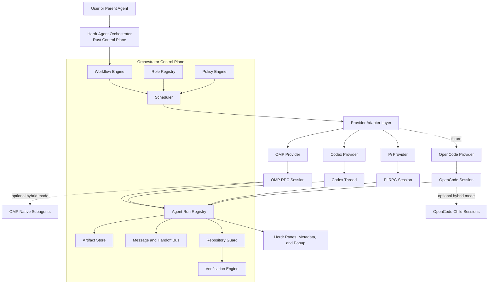

This avoids having several competing orchestration systems:

- Herdr pane and workspace management
- OMP native multi-agent coordination
- OpenCode child-session coordination
- A custom workflow runtime

Only Herdr Agent Orchestrator manages the top-level workflow. Provider-native multi-agent features may later be exposed as controlled nested capabilities.

## Design Principles

### Separate Provider, Role, Task, and Policy

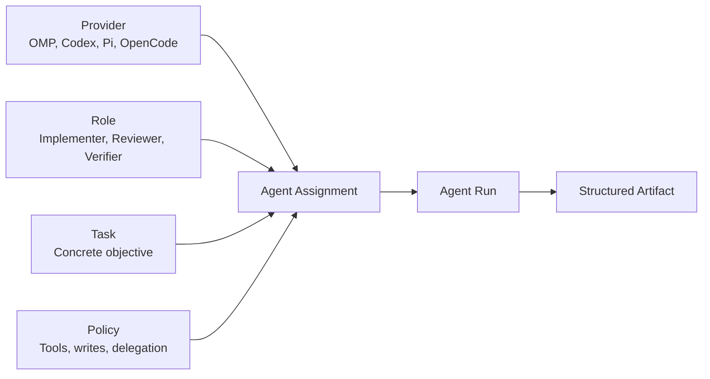

Each concept answers a different question:

| Concept | Question |
| --- | --- |
| Provider | Which execution engine runs the task? |
| Role | What responsibility does the agent have? |
| Task | What concrete outcome must be produced? |
| Policy | What is the agent permitted to do? |

A role must not be permanently tied to a provider.

Valid combinations include:

```text
OMP + Implementer
OMP + Reviewer
Codex + Implementer
Codex + Reviewer
Pi + Implementer
Pi + Verifier
OpenCode + Reviewer
```

### Prompts Describe; Policies Enforce

A prompt may tell a reviewer not to modify files.

The runtime must additionally:

- Remove editing tools where possible
- Use an empty write scope
- Capture a [Repository Snapshot](research/mvp/repository-safety-contract.md)
- Detect unexpected changes
- Reject the run if repository boundaries are violated

Prompts describe expected behavior. Policies enforce hard constraints.

### Structured Artifacts Over Shared Conversation History

Cross-provider collaboration uses structured artifacts rather than native chat history.

Recommended artifact types:

- `ImplementationReport`
- `ReviewReport`
- `VerificationReport`
- `ResearchReport`
- `HandoffPacket`
- `DecisionRequest`
- `CorrectionPacket`

This allows an OMP implementation result to be reviewed by Codex or Pi without converting provider-native sessions.

## Delegation Modes

The runtime supports three conceptual modes.

```rust
pub enum DelegationMode {
    Managed,
    Native,
    Hybrid,
}
```

### Managed Mode

All workflow nodes are created and controlled by Herdr Agent Orchestrator.

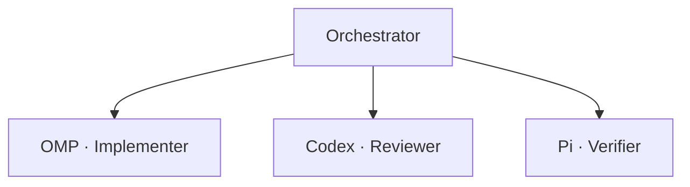

Managed mode provides:

- Uniform status
- Uniform policy enforcement
- Cross-provider workflows
- Centralized repository safety
- Predictable cancellation
- Provider replacement
- Simple debugging

This is the default and the only mode supported by the MVP.

### Native Mode

A provider uses its own multi-agent implementation.

Examples:

- OMP `task + hub`
- OpenCode child sessions

Native mode is not initially exposed as an unrestricted user option.

### Hybrid Mode

The top-level workflow remains managed by the orchestrator, but an individual provider run may create controlled native children.

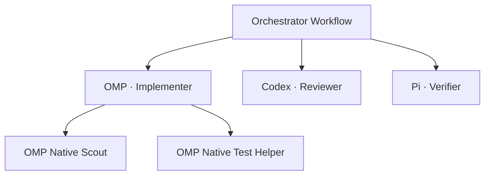

Recommended Hybrid restrictions:

- Native depth limited to one
- Native children belong to their parent `AgentRun`
- Native children cannot create top-level workflow nodes
- Native edits count against the parent write scope
- Native token, timeout, and concurrency usage count against the parent
- Only providers with observable native children may enable Hybrid mode

## Core Domain Model

### Agent Assignment

```rust
pub struct AgentAssignment {
    pub provider: ProviderKind,
    pub role_id: String,
    pub profile_id: Option<String>,
    pub delegation_mode: DelegationMode,
}
```

### Agent Run Specification

```rust
pub struct AgentRunSpec {
    pub schema_version: u32,
    pub run_id: RunId,
    pub workflow_id: Option<WorkflowRunId>,
    pub parent_run_id: Option<AgentRunId>,

    pub assignment: AgentAssignment,
    pub task: TaskPacket,
    pub resolved_role: ResolvedRole,
    pub effective_policy: ExecutionPolicy,
}
```

Example:

```json
{
  "schema_version": 1,
  "run_id": "run-0194",
  "title": "Fix download queue race",
  "assignment": {
    "provider": "omp",
    "role": "implementer",
    "delegation_mode": "managed"
  },
  "task": {
    "objective": "Prevent duplicate queue insertion",
    "context_paths": ["src/download/queue.rs"],
    "write_scope": ["src/download/queue.rs", "tests/download/"],
    "requirements": ["Preserve the existing public API"],
    "acceptance_criteria": ["Concurrent insertions produce one queue entry"],
    "verification": [
      {
        "command": "cargo test download_queue",
        "expected": "Exit 0 with focused tests passing"
      }
    ]
  },
  "timeout_seconds": 1800
}
```

## Provider Adapter Layer

All provider-specific behavior is hidden behind one Rust interface.

```rust
#[async_trait]
pub trait AgentProvider: Send + Sync {
    fn kind(&self) -> ProviderKind;

    fn capabilities(&self) -> ProviderCapabilities;

    async fn start(
        &self,
        spec: &AgentRunSpec,
        context: &RunContext,
    ) -> Result<ProviderSession>;

    async fn send(
        &self,
        session: &ProviderSession,
        input: AgentInput,
    ) -> Result<()>;

    async fn resume(
        &self,
        session: &ProviderSession,
        input: AgentInput,
    ) -> Result<()>;

    async fn cancel(
        &self,
        session: &ProviderSession,
    ) -> Result<()>;

    async fn subscribe(
        &self,
        session: &ProviderSession,
    ) -> Result<AgentEventStream>;

    async fn read_transcript(
        &self,
        session: &ProviderSession,
    ) -> Result<Transcript>;

    async fn list_children(
        &self,
        session: &ProviderSession,
    ) -> Result<Vec<ProviderChildSession>>;
}
```

### Provider Capabilities

```rust
pub struct ProviderCapabilities {
    pub persistent_session: bool;
    pub resumable: bool;
    pub cancellable: bool;
    pub structured_events: bool;
    pub background_execution: bool;

    pub native_subagents: bool;
    pub child_session_tree: bool;
    pub peer_messaging: bool;
}
```

Capability negotiation prevents the shared runtime from assuming that every provider supports the same native behavior.

## Provider Capability Matrix

| Capability | OMP | Codex | Pi | OpenCode |
| --- | ---: | ---: | ---: | ---: |
| Persistent session | Yes | Yes | Yes | Yes |
| Structured event stream | Yes | Yes | Yes | Yes |
| Cancellation | Yes | Yes | Yes | Yes |
| Steering or follow-up | Yes | Yes | Yes | Yes |
| Native subagents | Yes | Not required initially | No built-in system | Yes |
| Child-session tree | Agent registry | Thread and turn | Session branches, not role children | Yes |
| Peer messaging | `hub` | No shared peer bus | No built-in peer bus | No built-in peer bus |
| Provider-native resume | Session and messaging | Thread continuation | Session continuation | `task_id` continuation |
| Recommended initial mode | Managed | Managed | Managed | Managed |

## OMP Provider

Run OMP through:

```bash
omp --mode rpc
```

The Rust adapter communicates through JSONL over stdin and stdout.

OMP provides:

- Agent lifecycle events
- Tool lifecycle events
- Cancellation
- Session control
- Host-owned tools
- Native subagent subscriptions
- Subagent transcript access
- Native peer messaging through `hub`

OMP core multi-agent execution creates independent subagent sessions. It supports synchronous and asynchronous tasks, artifacts, transcripts, bounded concurrency, and follow-up messaging.

OMP RPC can expose:

```text
subagent_lifecycle
subagent_progress
subagent_event
```

The host can also use:

```text
set_subagent_subscription
get_subagents
get_subagent_messages
```

### Initial OMP Policy

For MVP:

- Disable or omit native task delegation
- Run OMP as a single managed worker
- Register host-owned structured completion tools
- Let the orchestrator own verification and repository validation

### Later Hybrid OMP Policy

After the managed runtime is stable:

- Enable OMP native read-only children
- Subscribe to child events
- Display children in the Herdr popup
- Limit native depth to one
- Keep editing children disabled by default
- Map OMP `hub` messages into the orchestrator message model

## Codex Provider

Run Codex through:

```bash
codex app-server
```

The adapter uses the App Server protocol and manages:

```text
initialize
thread/start
turn/start
turn/interrupt
```

The adapter preserves:

- Thread ID
- Current turn
- Streaming items
- Completion status
- Interruption state
- Transcript references

Codex is initially treated as a managed single-agent provider. Native multi-agent behavior is not required for the first architecture. The orchestrator can create several independent Codex runs when multiple roles are needed.

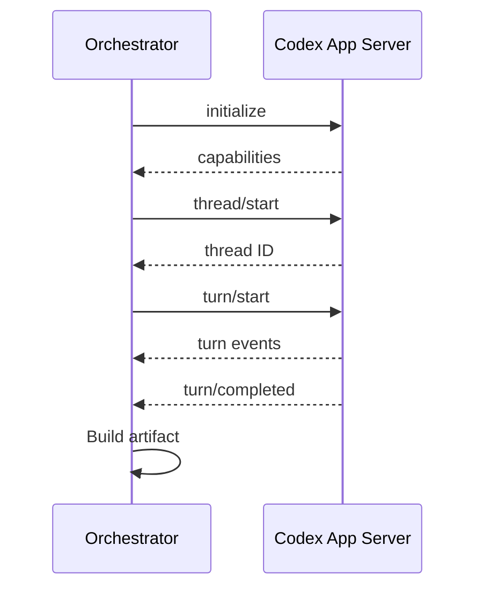

## Pi Provider

Pi is integrated as a managed single-agent provider.

Pi is an Agent Harness composed of:

```text
Model
+ System Prompt
+ Tools
+ Message History
+ Agent Loop
+ Session Runtime
```

The repository separates its implementation into:

- `pi-ai`: provider-independent model access
- `pi-agent-core`: Agent Loop, state, tools, and events
- `pi-coding-agent`: coding tools, sessions, extensions, and terminal modes

Pi deliberately does not ship a built-in role or subagent system. Its default coding agent exposes `read`, `bash`, `edit`, and `write`, while extensions and the SDK can add new tools and workflows.

Run Pi through:

```bash
pi --mode rpc
```

The Rust provider can use:

```text
prompt
steer
follow_up
abort
new_session
get_state
get_messages
set_model
set_thinking_level
```

Pi RPC exposes JSONL commands, responses, and streaming events over stdin and stdout.

### Pi Provider Mapping

| Orchestrator concept | Pi capability |
| --- | --- |
| Provider session | `AgentSession` |
| Session identity | Pi session ID |
| Start task | `prompt` |
| Steering | `steer` |
| Follow-up | `follow_up` |
| Cancel | `abort` |
| State | `get_state` |
| Transcript | `get_messages` or Session JSONL |
| Role behavior | System prompt |
| Tool policy | Tool allowlist and custom tools |
| Persistence | `SessionManager` |
| Events | AgentSession event stream |

Pi's Agent Loop repeatedly:

1. Sends system prompt, messages, and tools to the model
2. Streams the assistant response
3. Executes tool calls
4. Adds tool results to context
5. Calls the model again
6. Stops when no more work remains

### Pi Role Construction

The orchestrator can create distinct Pi role instances by changing:

- System prompt
- Tool allowlist
- Model
- Thinking level
- Skills
- Session manager
- Workspace

Example:

```text
Pi + Implementer
  tools: read, bash, edit, write

Pi + Reviewer
  tools: read, bash
  write scope: empty

Pi + Verifier
  tools: read, bash
  verification-only policy
```

Pi does not own the top-level workflow or create role agents itself. The orchestrator creates one Pi session per managed role.

## Future OpenCode Provider

OpenCode uses a Primary Agent and Child Session model.

A subagent invocation creates a real child session with:

- Session ID
- Parent session ID
- Agent type
- Model
- Permission rules
- Persistent messages
- Token and cost data

A later instruction can continue that child session by passing its existing `task_id`.

The OpenCode provider maps:

| Orchestrator concept | OpenCode capability |
| --- | --- |
| Provider session | OpenCode Session |
| Child identity | Child Session ID |
| Continue work | `task_id` |
| Role definition | OpenCode Agent configuration |
| Tool policy | Permission rules |
| Parent-child relation | Session `parentID` |
| Background work | Background Job, currently experimental |

OpenCode background subagents currently depend on an experimental feature flag, so they are not required by the initial provider implementation.

## Role System

Built-in MVP roles:

```text
implementer
reviewer
verifier
```

Future roles:

```text
planner
researcher
debugger
test-writer
documentation-writer
security-reviewer
frontend-specialist
release-manager
coordinator
```

### Role Definition

```rust
pub struct RoleDefinition {
    pub id: String,
    pub display_name: String,
    pub description: String,

    pub system_prompt: String,
    pub allowed_providers: Vec<ProviderKind>,
    pub preferred_provider: Option<ProviderKind>,

    pub policy: RolePolicy,
    pub output_schema: String,
    pub skills: Vec<String>,
}
```

### Role Policy

```rust
pub struct RolePolicy {
    pub can_modify_files: bool,
    pub can_delegate: bool,

    pub requires_write_scope: bool,
    pub requires_verification: bool,

    pub allowed_tools: Vec<String>,
    pub denied_tools: Vec<String>,

    pub allowed_child_roles: Vec<String>,
    pub max_delegation_depth: u8,
    pub max_child_agents: usize,
}
```

### Configuration

```text
$HERDR_PLUGIN_CONFIG_DIR/
├── roles/
│   ├── implementer.toml
│   ├── reviewer.toml
│   ├── verifier.toml
│   └── frontend-specialist.toml
└── workflows/
    └── implement-review-verify.toml
```

Example:

```toml
id = "code-reviewer"
display_name = "Code Reviewer"
description = "Reviews an implementation without modifying files."

system_prompt = """
Review the supplied implementation for correctness, regressions,
security risks, maintainability issues, and missing verification.
Do not edit repository files.
"""

allowed_providers = ["omp", "codex", "pi"]
preferred_provider = "codex"

can_modify_files = false
can_delegate = false
requires_write_scope = false
requires_verification = false

allowed_tools = ["read", "search", "shell"]
output_schema = "review-report-v1"
```

## Workflow Engine

Use a DAG with topological scheduling.

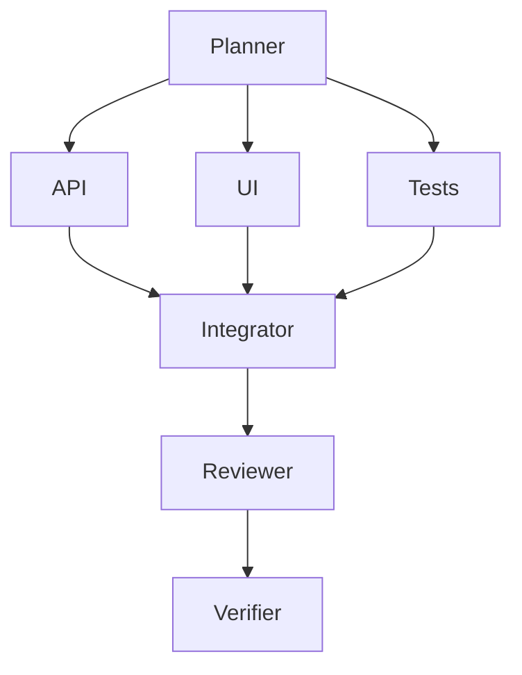

Execution waves:

```text
Wave 1: Planner
Wave 2: API, UI, Tests
Wave 3: Integrator
Wave 4: Reviewer
Wave 5: Verifier
```

A workflow node declares:

```rust
pub struct WorkflowNode {
    pub id: WorkflowNodeId,
    pub role_id: String,
    pub provider: ProviderSelector,
    pub depends_on: Vec<WorkflowNodeId>,
    pub input_artifacts: Vec<ArtifactSelector>,
    pub output_schema: String,
}
```

The first implementation does not need a general DAG editor. Start with:

```text
implementer → reviewer → verifier
```

Then introduce parallel waves.

## Agent Run Lifecycle

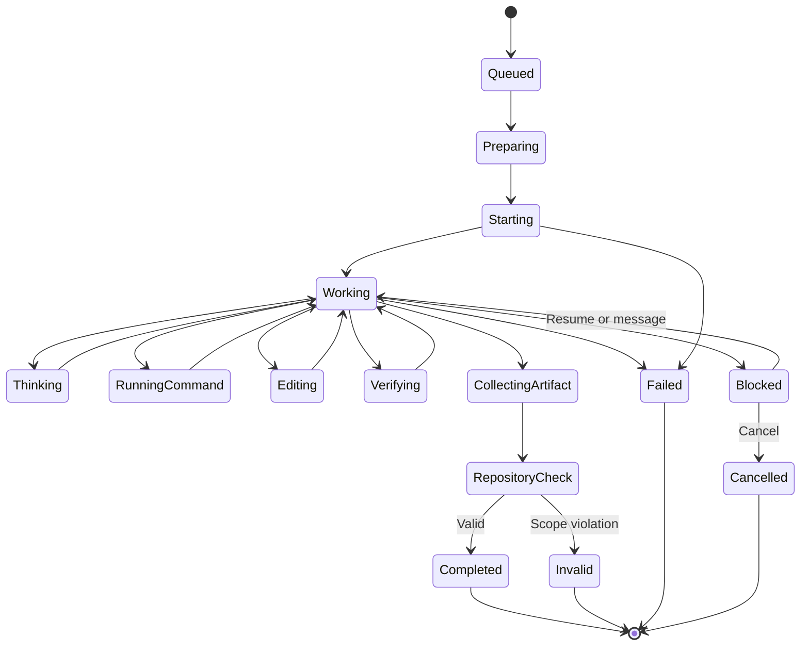

Normalized events:

```rust
pub enum AgentEvent {
    Starting,
    Ready,
    Thinking,

    RunningCommand {
        command: String,
    },

    EditingFile {
        path: PathBuf,
    },

    Verifying {
        command: String,
        index: usize,
        total: usize,
    },

    WaitingForInput {
        question: String,
    },

    ChildStarted {
        child: ProviderChildSession,
    },

    Progress {
        message: String,
    },

    Completed,
    Failed {
        message: String,
    },
    Cancelled,
}
```

## Structured Artifact Protocol

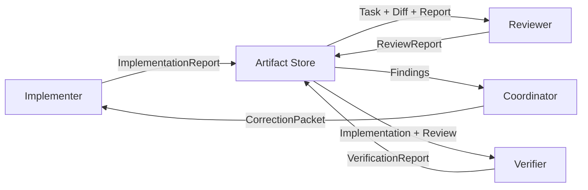

Every artifact contains:

```rust
pub struct ArtifactEnvelope<T> {
    pub schema_version: u32,
    pub artifact_id: ArtifactId,

    pub workflow_run_id: Option<WorkflowRunId>,
    pub producer_run_id: AgentRunId,

    pub role_id: String,
    pub provider: ProviderKind,

    pub created_at: DateTime<Utc>,
    pub payload: T,
}
```

Large outputs are referenced rather than embedded.

Examples:

```text
artifact://implementation/run-0194
artifact://review/run-0195
artifact://verification/run-0196
patch://run-0194
transcript://run-0195
```

## Message and Handoff Bus

Messages carry short instructions and artifact references.

```rust
pub struct AgentMessage {
    pub id: MessageId,
    pub from: AgentRunId,
    pub to: AgentRunId,

    pub kind: MessageKind,
    pub text: String,
    pub artifact_refs: Vec<ArtifactRef>,
}
```

Suitable message content:

- Additional constraints
- Clarifying questions
- Blocked-state explanations
- Requests for review
- Notifications that an artifact is ready

Unsuitable message content:

- Complete diffs
- Large source files
- Full reports
- Entire transcripts

Provider mapping:

```text
OMP      → hub.send or prompt
Codex    → new turn
Pi       → steer, follow_up, or prompt
OpenCode → task_id continuation
```

## Repository Safety

The [Managed repository safety contract](research/mvp/repository-safety-contract.md)
is authoritative for the MVP's Linux containment, snapshot, scope, publication,
and recovery guarantees.

### Before Execution

- Validate the task is bounded
- Resolve repository and linked-worktree identity
- Acquire a kernel-owned Worktree Lease
- Capture a full immutable Repository Snapshot, including dirty, untracked, and ignored state
- Preserve existing user changes
- Validate exact-file, subtree, scratch, ignored, dirty, and destructive-change policy
- Prove the fail-closed Linux containment backend and model broker
- Resolve the effective role policy
- Resolve workspace isolation

### During Execution

- Project the snapshot through a private Run Overlay instead of mounting the live worktree
- Enforce role tool restrictions
- Enforce filesystem, process-tree, command, credential, and network policy independently of the provider
- Track and seal the candidate Publish Delta
- Record provider events
- Prevent overlapping editing runs
- Reject unresolved architecture decisions
- Enforce timeout and cancellation

### After Execution

- Validate the Publish Delta against the Repository Snapshot and effective policy
- Compare the complete live worktree and Git state with the baseline before publication
- Confirm verification commands match the task specification
- Publish through a durable journal and per-path compare-and-swap operations
- Preserve invalid overlays and quarantine uncertain or partial publication
- Never automatically revert published or unexpected changes
- Mark invalid runs explicitly
- Return diff and evidence to the parent agent

Provider-level tool restrictions are not sufficient security boundaries.

Pi explicitly runs with the permissions of the user and process that launched it and recommends containerization or sandboxing for stronger isolation.

## Workspace Isolation

```rust
pub enum WorkspaceIsolation {
    CurrentWorktree,
    IsolatedWorktree,
}
```

### Current Worktree

Use when:

- The task depends on uncommitted user changes
- The task is small and mechanical
- The validated candidate should publish back to the selected worktree

`CurrentWorktree` identifies the baseline and publication target. The provider
still executes against a private Run Overlay and never receives the live
worktree as a writable mount.

Rule:

> Only one editing workflow may hold the Worktree Lease for a worktree.

Read-only reviewers and verifiers may run concurrently when safe.

### Isolated Worktree

Use when:

- Tasks can be separated cleanly
- Multiple implementation nodes run in parallel
- Changes are high risk
- Integration should happen after independent review

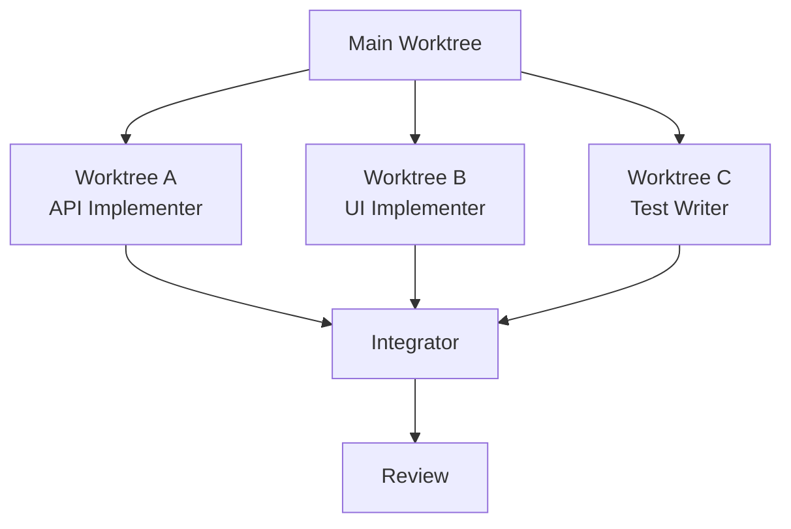

Merging remains a parent-agent or integrator responsibility.

## State Storage

Use SQLite for indexed runtime state and files for large artifacts.

```text
$HERDR_PLUGIN_STATE_DIR/
├── orchestrator.db
├── artifacts/
│   └── <artifact-id>.json
├── transcripts/
├── logs/
├── patches/
└── provider-state/
```

SQLite tables:

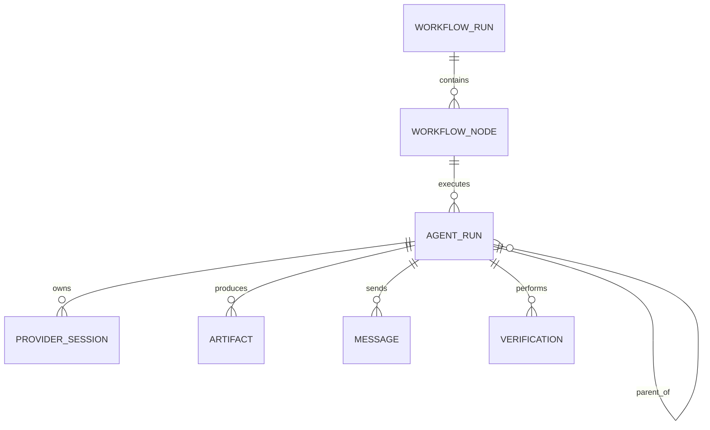

Store in SQLite:

- Workflow runs
- Workflow nodes
- Agent runs
- Provider sessions
- Parent-child relationships
- Role and policy snapshots
- Current status
- Pane mappings
- Artifact indexes
- Verification results
- Messages

Store as files:

- Transcripts
- Provider logs
- Diffs
- Patches
- Large reports
- Provider-native session references

## Herdr UI

The real provider process runs in a normal Herdr pane. The popup only displays and controls the run.

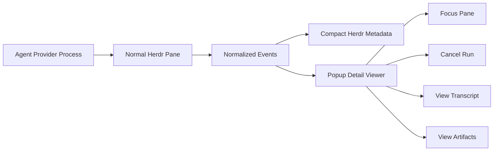

Suggested tree:

```text
Feature: Download Queue
├── ✓ Planner
│   └── Codex
├── ● Implementer
│   └── OMP
│       ├── ✓ Scout
│       └── ● Test Helper
├── ○ Reviewer
│   └── Codex
└── ○ Verifier
    └── Pi
```

Suggested detail view:

```text
Role          Implementer
Provider      OMP
State         Working
Delegation    Hybrid
Worktree      task/download-queue
Policy        Scoped edit · depth 1
Session       omp-7f82
Runtime       04:21

Current step
cargo test download_queue

Native children
├── Scout       done
└── TestHelper  running

Changed files
M src/download/queue.rs
A tests/download/queue_test.rs
```

Recommended TUI libraries:

- Ratatui
- Crossterm
- Tokio

## Suggested Rust Project Structure

```text
herdr-agent-orchestrator/
├── Cargo.toml
├── herdr-plugin.toml
├── schemas/
│   ├── agent-run-spec.schema.json
│   ├── role-definition.schema.json
│   ├── workflow-definition.schema.json
│   ├── execution-policy.schema.json
│   └── artifact-envelope.schema.json
└── src/
    ├── main.rs
    ├── cli.rs
    │
    ├── commands/
    │   ├── run.rs
    │   ├── worker.rs
    │   ├── popup.rs
    │   ├── cancel.rs
    │   ├── focus.rs
    │   └── inspect.rs
    │
    ├── provider/
    │   ├── mod.rs
    │   ├── capabilities.rs
    │   ├── session.rs
    │   ├── omp/
    │   ├── codex/
    │   ├── pi/
    │   └── opencode/
    │
    ├── role/
    │   ├── definition.rs
    │   ├── registry.rs
    │   ├── loader.rs
    │   └── resolver.rs
    │
    ├── policy/
    │   ├── execution.rs
    │   ├── tools.rs
    │   ├── repository.rs
    │   └── delegation.rs
    │
    ├── workflow/
    │   ├── definition.rs
    │   ├── dag.rs
    │   ├── scheduler.rs
    │   ├── coordinator.rs
    │   └── handoff.rs
    │
    ├── artifact/
    │   ├── envelope.rs
    │   ├── store.rs
    │   ├── implementation.rs
    │   ├── review.rs
    │   ├── verification.rs
    │   └── handoff.rs
    │
    ├── message/
    │   ├── bus.rs
    │   └── routing.rs
    │
    ├── guard/
    │   ├── git_snapshot.rs
    │   ├── write_scope.rs
    │   ├── repository_lock.rs
    │   └── verification.rs
    │
    ├── herdr/
    │   ├── cli.rs
    │   ├── socket.rs
    │   └── metadata.rs
    │
    ├── state/
    │   ├── database.rs
    │   ├── migrations.rs
    │   └── models.rs
    │
    └── ui/
        ├── app.rs
        ├── event.rs
        ├── tree.rs
        └── view.rs
```

## Suggested Dependencies

```text
tokio
serde
serde_json
toml
clap
async-trait
thiserror
anyhow
tracing
tracing-subscriber
ratatui
crossterm
uuid
chrono
fs2
sqlx
jsonschema
```

Use the Git CLI initially instead of `git2`.

## Implementation Roadmap

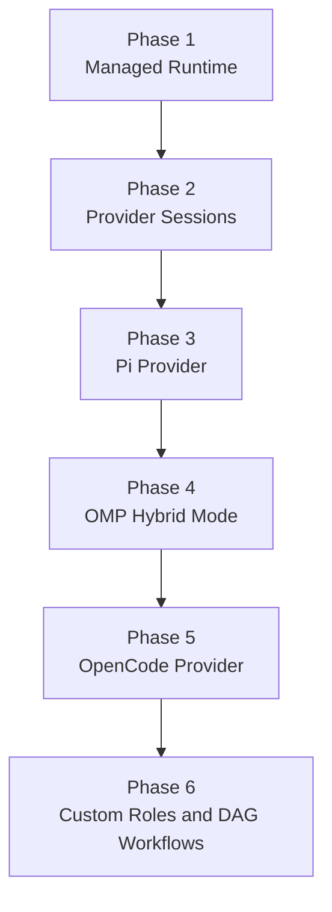

### Phase 1: Managed Runtime

Implement:

- Rust plugin runtime
- OMP Provider
- Codex Provider
- `implementer`, `reviewer`, and `verifier`
- Explicit provider selection
- Structured `AgentRunSpec`
- Repository baseline
- Write-scope enforcement
- Repository edit lock
- Verification engine
- SQLite state
- Artifact store
- Herdr metadata
- Popup UI
- Cancel, focus, and inspect

Disable provider-native subagents.

### Phase 2: Provider Session Capabilities

Implement:

- OMP session persistence
- Codex thread persistence
- Provider capability negotiation
- Resume
- Steering and follow-up
- Transcript retrieval
- Handoff packets
- Isolated worktrees

### Phase 3: Pi Provider

Implement:

- `pi --mode rpc`
- Pi session identity
- Prompt, steer, follow-up, and abort
- Event normalization
- Tool allowlist mapping
- Role system-prompt mapping
- Transcript and state retrieval
- Pi as managed implementer, reviewer, or verifier

### Phase 4: OMP Hybrid Mode

Implement:

- Native subagent subscriptions
- OMP child tree
- Native child transcripts
- `hub` message mapping
- Native depth limit
- Parent-run budget accounting
- Read-only native helpers first

### Phase 5: OpenCode Provider

Implement:

- OpenCode Session mapping
- Parent-child session trees
- `task_id` continuation
- Permission mapping
- Child-session popup
- Optional background-job support

### Phase 6: Custom Roles and Workflows

Implement:

- User role TOML or Markdown
- Role inheritance
- Policy presets
- Workflow YAML or TOML
- Parallel waves
- Provider auto-routing
- Controlled coordinator roles

## MVP Scope

The first usable release includes:

1. Rust plugin runtime
2. OMP Provider
3. Codex Provider
4. Managed delegation mode
5. Explicit provider selection
6. Built-in roles
7. Structured task packets
8. Repository baseline capture
9. Write-scope enforcement
10. Repository edit lock
11. Verification commands
12. Normalized events
13. Persistent SQLite state
14. Structured artifacts
15. Herdr metadata
16. Ratatui popup
17. Cancel, focus, and inspect
18. Parent-agent final review

Pi Provider is the first provider added after the MVP.

## Deferred Features

Do not include these in the initial release:

- Automatic provider selection
- Provider-native subagents
- OpenCode Provider
- User-defined roles
- Role inheritance
- General workflow DAG execution
- Multiple editing agents in one worktree
- Automatic merge
- Automatic rollback
- Deep recursive delegation
- Web dashboard
- Native graphical UI
- Distributed workers

## References

### Herdr

- [Plugin System](https://herdr.dev/docs/plugins/)
- [Socket API](https://herdr.dev/docs/socket-api/)
- [Agent Management](https://herdr.dev/docs/agents/)
- [Integrations](https://herdr.dev/docs/integrations/)
- [CLI Reference](https://herdr.dev/docs/cli-reference/)

### OMP

- [Oh My Pi Repository](https://github.com/can1357/oh-my-pi)
- [OMP RPC Reference](https://github.com/can1357/oh-my-pi/blob/main/docs/rpc.md)
- [OMP Task Tool](https://github.com/can1357/oh-my-pi/blob/main/docs/tools/task.md)
- [OMP Hub Tool](https://github.com/can1357/oh-my-pi/blob/main/docs/tools/hub.md)
- [OMP Swarm Extension](https://github.com/can1357/oh-my-pi/tree/main/packages/swarm-extension)

### Codex

- [Codex App Server](https://developers.openai.com/codex/app-server)
- [Codex SDK](https://developers.openai.com/codex/codex-sdk)
- [Codex Configuration](https://developers.openai.com/codex/config-reference)

### Pi

- [Pi Repository](https://github.com/earendil-works/pi)
- [Pi Coding Agent](https://github.com/earendil-works/pi/tree/main/packages/coding-agent)
- [Pi Agent Core](https://github.com/earendil-works/pi/tree/main/packages/agent)
- [Pi SDK](https://github.com/earendil-works/pi/blob/main/packages/coding-agent/docs/sdk.md)
- [Pi RPC Mode](https://github.com/earendil-works/pi/blob/main/packages/coding-agent/docs/rpc.md)

### OpenCode

- [OpenCode Repository](https://github.com/anomalyco/opencode)
- [OpenCode Agents](https://github.com/anomalyco/opencode/blob/dev/packages/web/src/content/docs/agents.mdx)
- [OpenCode Task Tool](https://github.com/anomalyco/opencode/blob/dev/packages/opencode/src/tool/task.ts)

### Rust

- [Tokio](https://tokio.rs/)
- [Serde](https://serde.rs/)
- [Ratatui](https://ratatui.rs/)
- [Crossterm](https://docs.rs/crossterm/)
- [Clap](https://docs.rs/clap/)
- [SQLx](https://github.com/launchbadge/sqlx)
